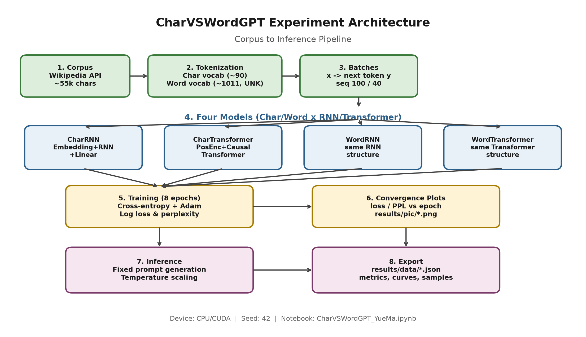

# MEL29 — Character-level vs Word-level Language Modeling

Empirical comparison of **RNNs** and **Transformers** at character and word granularity (PyTorch).

**Author:** Yue Ma  
**Course:** MEL29 - Language Resources and Processes  
**Repository:** https://github.com/nikk909/MEL29_Language_Resources_and_Processes  
**Main notebook:** `CharVSWordGPT_YueMa.ipynb`  
**Paper:** `MEL29_CharVSWordGPT_YueMa.pdf` / `MEL29_CharVSWordGPT_YueMa.docx`

---

## Overview

This project trains and compares four language models on a small English Wikipedia corpus (~55k characters):

| Model | Granularity | Architecture |
|-------|-------------|--------------|
| CharRNN | character | Embedding + multi-layer RNN + Linear |
| CharTransformer | character | Embedding + positional encoding + causal TransformerEncoder + Linear |
| WordRNN | word | same RNN structure |
| WordTransformer | word | same Transformer structure |

**Main finding (8 epochs, CPU):** at word level, WordTransformer beats WordRNN (PPL ≈ 38.8 vs 66.3); at character level, CharRNN beats CharTransformer (PPL ≈ 4.9 vs 10.8). Absolute character PPL is not comparable across granularities because of vocabulary size.

---

## Architecture



Flow: **Corpus (Wikipedia API) → clean text → character / word tokenization → four models → train (loss & PPL) → generation & temperature → export to `results/`**.

---

## Data

- **Source:** English Wikipedia via MediaWiki API (`prop=extracts&explaintext=1`)
- **Size:** about **55,047** cleaned characters
- **Character vocab:** ~90 types
- **Word vocab:** ~1,011 types after frequency filtering (`<UNK>` for rare words)
- **Windows:** character seq_len 100; word seq_len 40; batch size 32

---

## Setup

```bash
python -m venv venv
# Windows:
venv\Scripts\activate
# Linux/macOS:
# source venv/bin/activate

pip install -r requirements.txt
```

Dependencies: see `requirements.txt` (PyTorch, Jupyter, matplotlib, requests, etc.).

---

## How to run

1. Open `CharVSWordGPT_YueMa.ipynb` in Jupyter / VS Code / Cursor.
2. Run all cells in order (bootstrap → corpus → tokenize → models → train → generate → export).
3. Optional: set `EPOCHS` in the training cell (reported paper run used **8**).
4. Outputs are written to:
   - `results/pic/` — figures
   - `results/data/` — JSON metrics and samples

Fixed seed: **42**. Reported run used Adam learning rate **0.003** on **CPU**.

---

## Models

- **RNN branch:** multi-layer RNN with truncated BPTT and gradient clipping.
- **Transformer branch:** learned positional encoding + causal masking (`is_causal` / subsequent mask) for autoregressive next-token prediction.
- Shallow settings (e.g. ~2 layers, embedding / d_model ≈ 128) for a fair small-scale comparison.

---

## Results

### Final metrics (8 epochs)

| Model | Final Loss | Final PPL |
|-------|----------:|---------:|
| CharRNN | 1.5905 | 4.91 |
| CharTransformer | 2.3765 | 10.77 |
| WordRNN | 4.1945 | 66.32 |
| WordTransformer | 3.6581 | 38.79 |

### Figures

| File | Description |
|------|-------------|
| `results/pic/architecture_roadmap.png` | Pipeline roadmap |
| `results/pic/fig_training_loss.png` | Training loss vs epoch |
| `results/pic/fig_training_perplexity.png` | Training PPL vs epoch |

### Data exports

| File | Description |
|------|-------------|
| `results/data/final_metrics.json` | Final loss / PPL |
| `results/data/training_curves.json` | Per-epoch curves |
| `results/data/generation_samples.json` | Fixed-prompt generations + temperature sweep |
| `results/data/results_summary.md` | Short text summary |

Interpret PPL **within** the same tokenization granularity. Generation quality remains limited under this data and training budget.

---

## Limitations

- Small corpus (~55k characters) and short training (8 epochs)
- Single random seed; no per-model learning-rate search
- RNN baseline is a plain multi-layer RNN (not LSTM/GRU)
- Shallow models; not industrial-scale Transformers
- Evaluation emphasizes training PPL and qualitative generation, not large-scale fluency metrics

---

## Paper

Term paper deliverables in the repository root:

- `MEL29_CharVSWordGPT_YueMa.pdf`
- `MEL29_CharVSWordGPT_YueMa.docx`

LaTeX / draft sources used during writing live under the local `file/` folder (not tracked by git).
