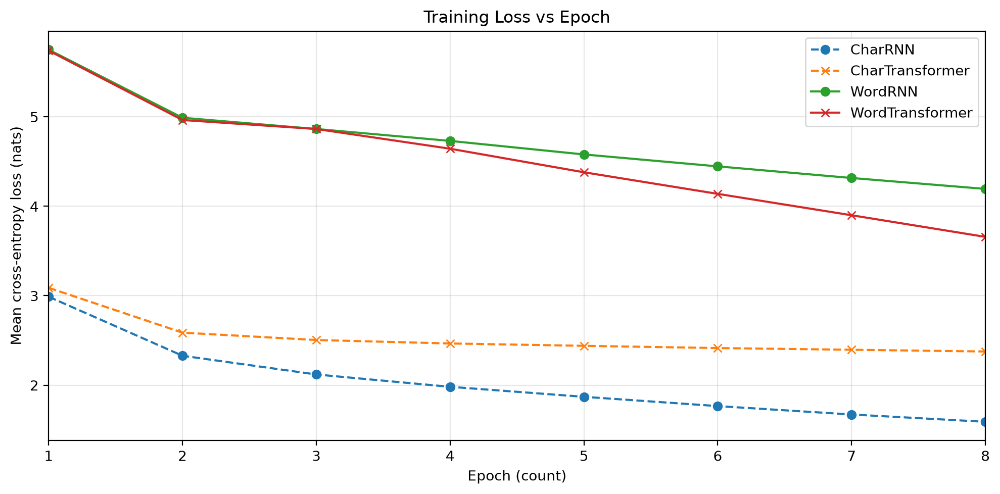
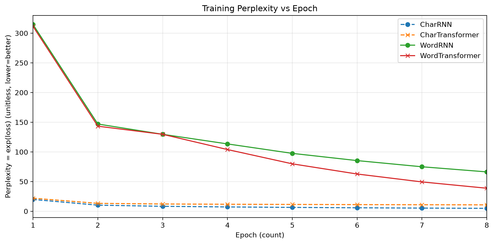

# Experiment Results Summary

- Corpus characters: 55047
- Char vocab size: 90
- Word vocab size: 1011 (min_freq=2)
- Device: cpu
- Epochs: 8

## Final Metrics

| Model | Final Loss | Final PPL | Best PPL |
|---|---:|---:|---:|
| CharRNN | 1.5905 | 4.91 | 4.91 |
| CharTransformer | 2.3765 | 10.77 | 10.77 |
| WordRNN | 4.1945 | 66.32 | 66.32 |
| WordTransformer | 3.6581 | 38.79 | 38.79 |

## Figures

- 
- 

## Notes for paper

- Character-level loss is often lower because the vocab is much smaller (~100 vs thousands).
- Compare spelling quality (char models) vs grammatical coherence (word models).
- Discuss temperature effects on diversity vs fluency.
